Simulated Workload Performance Comparison
=========================================

While the :doc:`competitive performance comparison<performance>` is useful for
identifying strengths and weaknesses in the API, it doesn't reflect the
variable nature of real-life workloads. In August 2014, a survey of use cases
for sorted list data types was made through repeated searches of Github. The
analysis identified several common use patterns.

These benchmarks attempt to mimic the usage patterns observed in other
projects. Those patterns are summarized in the following names:

* *Priority Queue* -- Represents a priority queue data structure. In addition
  to the normal `add` and `pop` routines that can be efficiently managed with
  the `heapq` module in the standard library, projects required the ability to
  test for list ownership of values and occasional removal. A common use case
  also involved iterating the entire priority queue. The recipe described in
  the Python docs is insufficient as a priority queue for these projects in two
  ways: not every inserted value corresponds to a unique key and sorted
  iteration is not supported in linear time.

* *Multiset* -- Represents a multiset data structure. While the
  `collections.Counter` data type is commonly suggested for implementing a
  multiset in Python, some projects required the ability to efficiently lookup
  the greatest or least item in the set.

* *Ranking* -- Represents those projects that repeatedly looked up the index of
  items in the sorted list. Sometimes this occurred as part of prioritizing
  elements and reporting their rank. Imagine trying to identify an element's
  position in a work queue.

* *Neighbor* -- This pattern was observed in several implementations of
  machine-learning algorithms (e.g. K-nearest-neighbor search). An iterative
  process was applied to a set of values in which they were repeatedly bisected
  and occasionally iterated. The bisect process attempts to find the nearest
  values to a given one.

* *Intervals* -- Perhaps the most complex usage pattern, these projects
  maintained a list of intervals and were often querying a sorted list to
  determine those which overlapped. In addition to bisecting the list to
  identify nearest intervals, range queries were used to determine
  overlap. Frequent indexing was also apparent.

The performance of each benchmark is displayed below along with each of the
other data types implementing the necessary operations. Before the benchmark
begins, the list is populated with values and then corresponding to the list
size, a number of operations are performed. Each workload has been reduced to a
set of operations with associated frequencies. For example, the priority queue
simulates `add` and `pop` each 40% of the time.

Though these workloads strive to be realistic, they are still quite
synthetic. No attempt is made to exercise memory allocation or cache
interference while sorted list operations are performed. The frequency of each
operation is also estimated because no projects had performance benchmarks that
were easily evaluated.

The legends of the graphs below correlate the underlying data structure used to
the Python project. The correlation is as follows:

.. currentmodule:: sortedcontainers

======================  ==================================
Data Structure          Project
======================  ==================================
:class:`SortedList`     :doc:`Sorted Containers<index>`
:class:`SortedKeyList`  :doc:`Sorted Containers<index>`
B-Tree                  `blist on PyPI`_
List                    `sortedcollection recipe`_
======================  ==================================

.. _`blist on PyPI`: https://pypi.org/project/blist/
.. _`sortedcollection recipe`: http://code.activestate.com/recipes/577197-sortedcollection/

Sorted List
-----------

Graphs comparing :doc:`sortedlist` performance.

Priority Queue
..............

Simulates a *Priority Queue* workload as described above. The mix of operations
and their frequencies:

* 40% :func:`SortedList.add`
* 40% :func:`SortedList.pop`
* 10% :func:`SortedList.discard`
* 9% :func:`SortedList.__contains__`
* 1% :func:`SortedList.__iter__` (limited to first 100 elements)

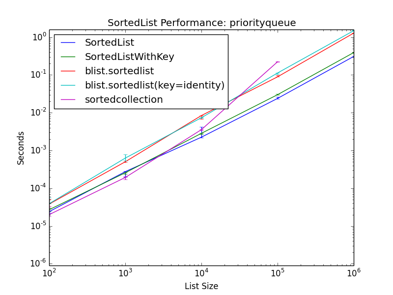

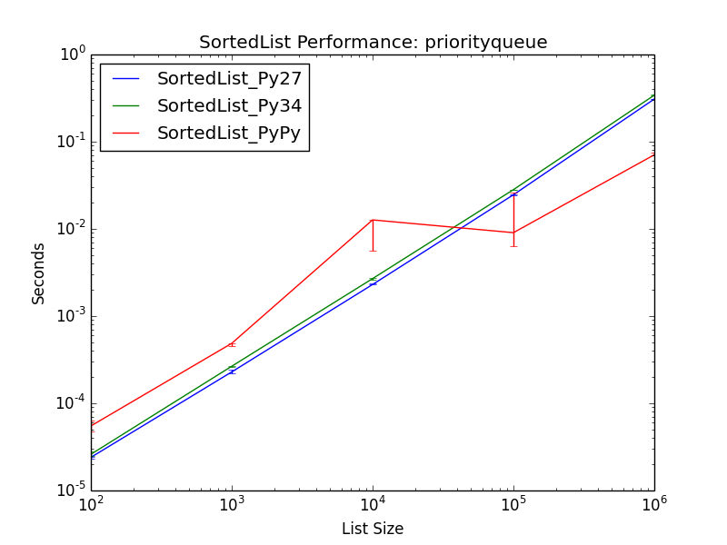

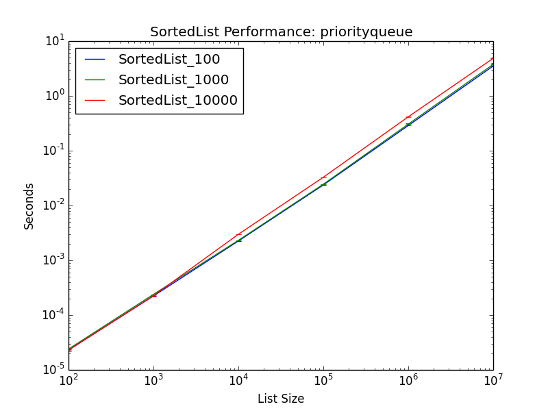

Multiset
........

Simulates a *Multiset* workload as described above. The mix of operations and
their frequencies:

* 75% :func:`SortedList.__contains__`
* 10% :func:`SortedList.add`
* 10% :func:`SortedList.remove`
* 5% :func:`SortedList.__getitem__`

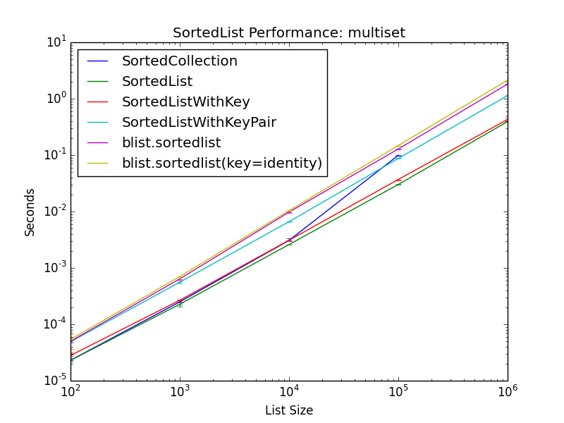

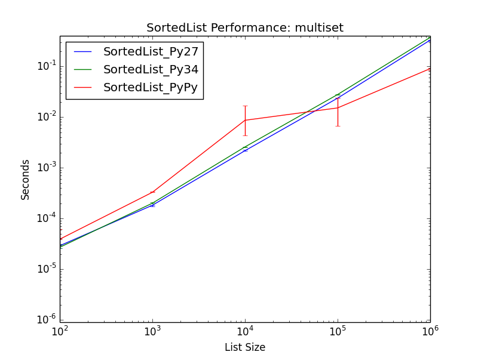

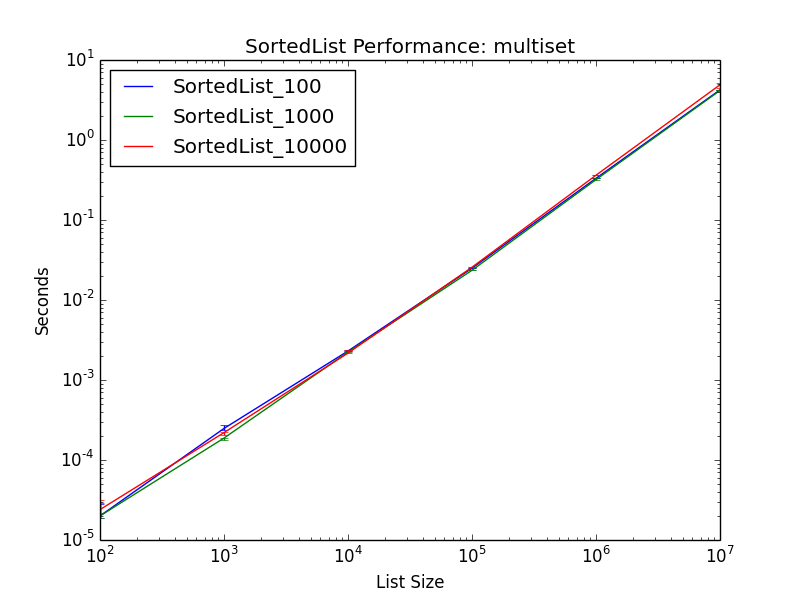

Ranking
.......

Simulates a *Ranking* workload as described above. The mix of operations and
their frequencies:

* 40% :func:`SortedList.__getitem__`
* 40% :func:`SortedList.index`
* 10% :func:`SortedList.add`
* 10% :func:`SortedList.remove`

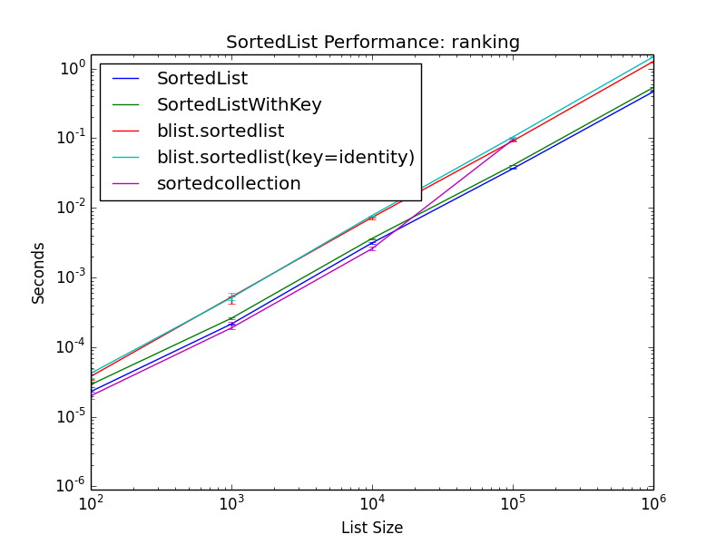

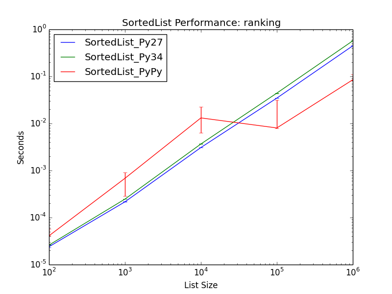

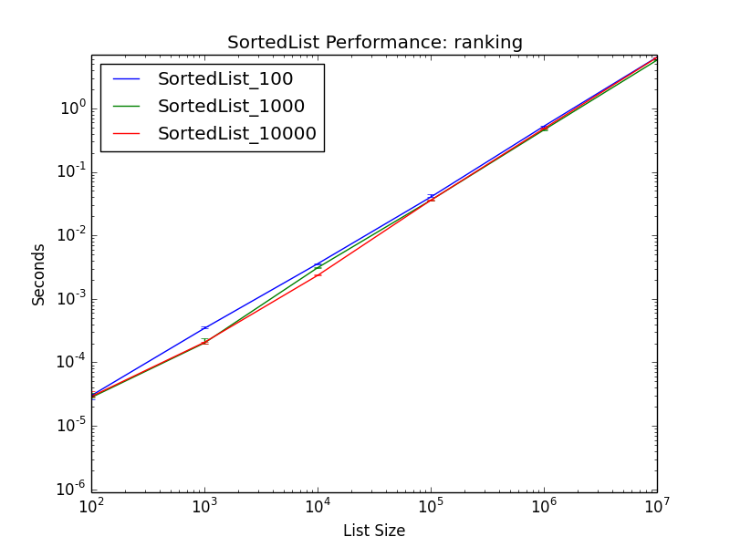

Neighbor
........

Simulates a *Neighbor* workload as described above. The mix of operations and
their frequencies:

* 75% :func:`SortedList.bisect`
* 10% :func:`SortedList.add`
* 10% :func:`SortedList.remove`
* 5% :func:`SortedList.__iter__` (limited to first 100 elements)

.. image:: _static/SortedList-neighbor.png

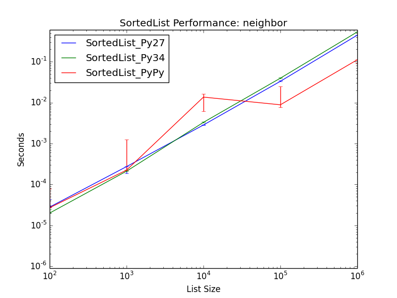

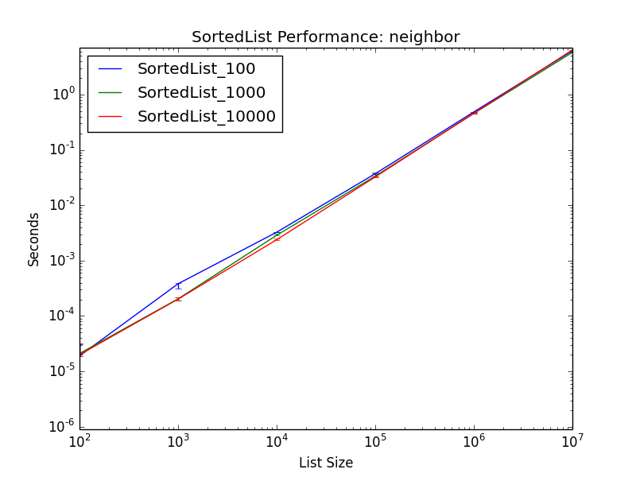

Intervals
.........

Simulates an *Intervals* workload as described above. The mix of operations and
their frequencies:

* 30% :func:`SortedList.bisect`
* 20% :func:`SortedList.__getitem__`
* 20% :func:`SortedList.__delitem__`
* 10% :func:`SortedList.__getitem__` (range query)
* 10% :func:`SortedList.add`
* 10% :func:`SortedList.discard`

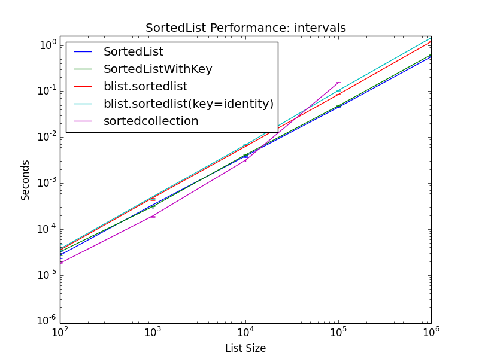

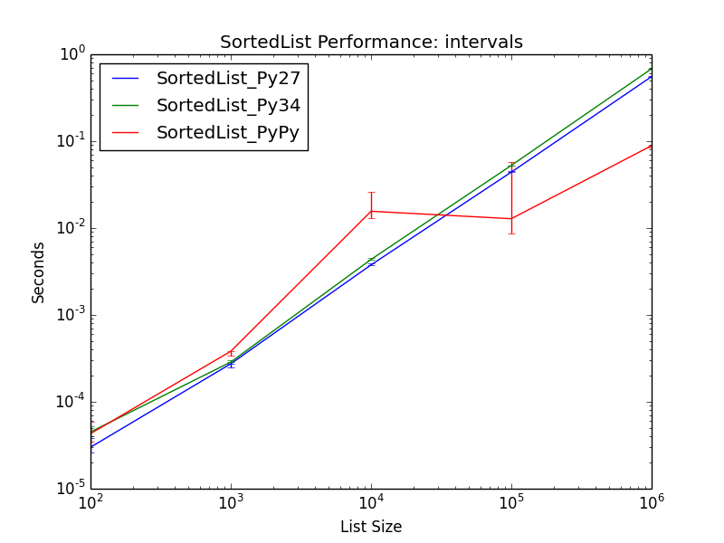

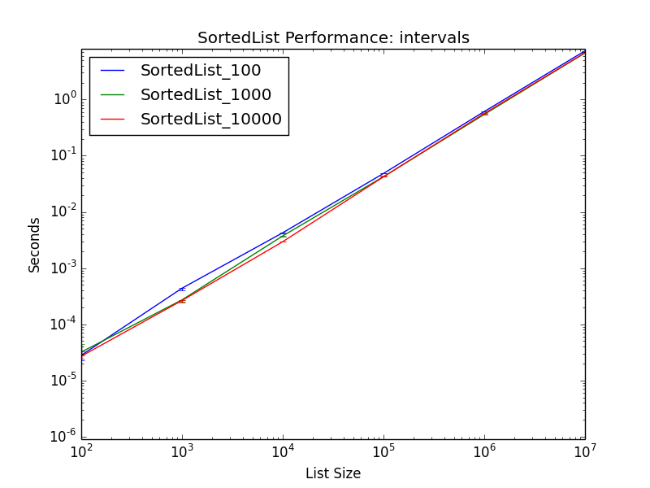

Other Performance Comparisons
-----------------------------

:doc:`Sorted Containers<index>` uses a segmented-list data structure similar to
a B-tree limited to two levels of nodes. As part of the implementation, a load
factor is used to determine how many values should be stored in each node. This
can have a significant impact on performance and a :doc:`load factor
performance comparison<performance-load>` is also provided.

Because :doc:`Sorted Containers<index>` is pure-Python, its performance also
depends directly on the Python runtime. A :doc:`runtime performance
comparison<performance-runtime>` is also included with data from popular Python
runtimes.
