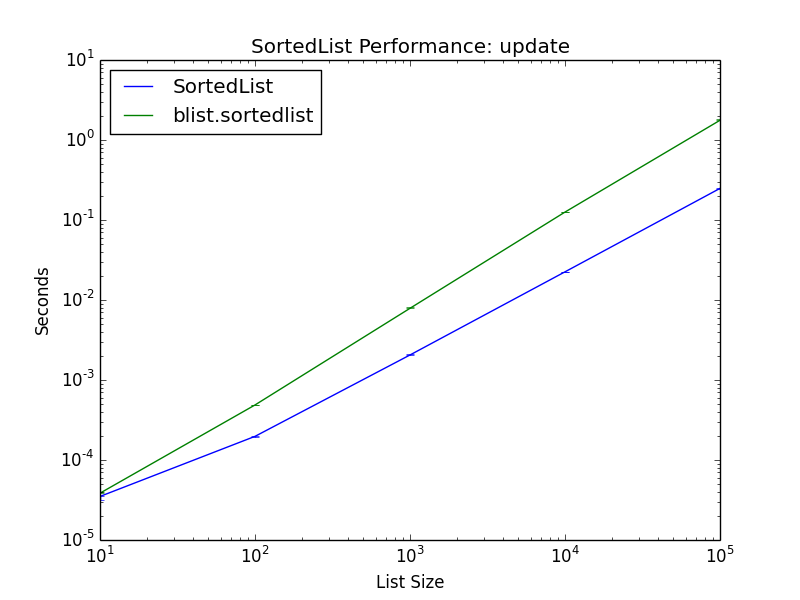

Performance Comparison
======================

# Benchmark Comparisons

* https://pypi.python.org/pypi/rbtree
  - c-module
  - rbtree.rbtree is SortedDict
  - rbtree.rbset is SortedSet
* https://pypi.python.org/pypi/blist
  - c and python implementations
  - blist.sortedlist is SortedList
  - blist.sorteddict is SortedDict
  - blist.sortedset is SortedSet
* https://pypi.python.org/pypi/treap
  - depends on cython
  - treap.treap is SortedDict
* https://pypi.python.org/pypi/bintrees
  - had to install from exe on Windows
  - bintrees.FastAVLTree is SortedDict & SortedSet
  - bintrees.FastRBTree is SortedDict & SortedSet
* https://pypi.python.org/pypi/skiplistcollections
  - pure python
  - skiplistcollections.SkipListDict
  - skiplistcollections.SkipListSet

## Not Easily Installable

* http://newcenturycomputers.net/projects/rbtree.html
* https://github.com/pgrafov/python-avl-tree
* https://pypi.python.org/pypi/pyavl
  - Fails to install on Windows

# source/methodology, number of tries, etc.
# tiny vs small vs medium vs large
# missing data meant it either took too long or failed

SortedList
----------

Graphs comparing :doc:`SortedList<sortedlist>` performance.

add
...

Randomly adding values using :ref:`SortedList.add<SortedList.add>`.

.. image:: _static/SortedList-add.png

contains
........

Randomly testing membership using :ref:`SortedList.__contains__<SortedList.__contains__>`.

.. image:: _static/SortedList-contains.png

count
.....

Counting objects at random using :ref:`SortedList.count<SortedList.count>`.

.. image:: _static/SortedList-count.png

__delitem__
...........

Deleting objects at random using :ref:`SortedList.__delitem__<SortedList.__delitem__>`.

.. image:: _static/SortedList-delitem.png

__getitem__
...........

Retrieving ojbects by index using :ref:`SortedList.__getitem__<SortedList.__getitem__>`.

.. image:: _static/SortedList-getitem.png

index
.....

Finding the index of an object using :ref:`SortedList.index<SortedList.index>`.

.. image:: _static/SortedList-index.png

iter
....

Iterating a SortedList using :ref:`SortedList.__iter__<SortedList.__iter__>`.

.. image:: _static/SortedList-iter.png

pop
...

Removing the last object using :ref:`SortedList.pop<SortedList.pop>`.

.. image:: _static/SortedList-pop.png

remove
......

Remove an object at random using :ref:`SortedList.remove<SortedList.remove>`.

.. image:: _static/SortedList-remove.png

update
......

Updating a SortedList using :ref:`SortedList.update<SortedList.update>`.

SortedDict
----------

Graphs comparing :doc:`SortedDict<sorteddict>` performance.

__getitem__
...........

Given a key at random, retrieve the value using :ref:`SortedDict.__getitem__<SortedDict.__getitem__>`.

.. image:: _static/SortedDict-getitem.png

__setitem__
...........

Given a key at random, set the value using :ref:`SortedDict.__setitem__<SortedDict.__setitem__>`.

.. image:: _static/SortedDict-setitem.png

__delitem__
...........

Given a key at random, delete the value using :ref:`SortedDict.__delitem__<SortedDict.__delitem__>`.

.. image:: _static/SortedDict-delitem.png

iter
....

Iterate the keys of a SortedDict using :ref:`SortedDict.__iter__<SortedDict.__iter__>`.

.. image:: _static/SortedDict-iter.png

setitem_existing
................

Given an existing key at random, set the value using :ref:`SortedDict.__setitem__<SortedDict.__setitem__>`.

.. image:: _static/SortedDict-setitem_existing.png

SortedSet
---------

Graphs comparing :doc:`SortedSet<sortedset>` performance.

add
...

Randomly add values using :ref:`SortedSet.add<SortedSet.add>`.

.. image:: _static/SortedSet-add.png

contains
........

Randomly test membership using :ref:`SortedSet.contains<SortedSet.contains>`.

.. image:: _static/SortedSet-contains.png

difference_large
................

Set difference using :ref:`SortedSet.difference<SortedSet.difference>`.

.. image:: _static/SortedSet-difference_large.png

difference_medium
.................

Set difference using :ref:`SortedSet.difference<SortedSet.difference>`.

.. image:: _static/SortedSet-difference_medium.png

difference_small
................

Set difference using :ref:`SortedSet.difference<SortedSet.difference>`.

.. image:: _static/SortedSet-difference_small.png

difference_tiny
...............

Set difference using :ref:`SortedSet.difference<SortedSet.difference>`.

.. image:: _static/SortedSet-difference_tiny.png

difference_update_large
.......................

Set difference using :ref:`SortedSet.difference_update<SortedSet.difference_update>`.

.. image:: _static/SortedSet-difference_update_large.png

difference_update_medium
........................

Set difference using :ref:`SortedSet.difference_update<SortedSet.difference_update>`.

.. image:: _static/SortedSet-difference_update_medium.png

difference_update_small
.......................

Set difference using :ref:`SortedSet.difference_update<SortedSet.difference_update>`.

.. image:: _static/SortedSet-difference_update_small.png

difference_update_tiny
......................

Set difference using :ref:`SortedSet.difference_update<SortedSet.difference_update>`.

.. image:: _static/SortedSet-difference_update_tiny.png

intersection_large
..................

Set intersection using :ref:`SortedSet.intersection<SortedSet.intersection>`.

.. image:: _static/SortedSet-intersection_large.png

intersection_medium
...................

Set intersection using :ref:`SortedSet.intersection<SortedSet.intersection>`.

.. image:: _static/SortedSet-intersection_medium.png

intersection_small
..................

Set intersection using :ref:`SortedSet.intersection<SortedSet.intersection>`.

.. image:: _static/SortedSet-intersection_small.png

intersection_tiny
.................

Set intersection using :ref:`SortedSet.intersection<SortedSet.intersection>`.

.. image:: _static/SortedSet-intersection_tiny.png

intersection_update_large
.........................

Set intersection using :ref:`SortedSet.intersection_update<SortedSet.intersection_update>`.

.. image:: _static/SortedSet-intersection_update_large.png

intersection_update_medium
..........................

Set intersection using :ref:`SortedSet.intersection_update<SortedSet.intersection_update>`.

.. image:: _static/SortedSet-intersection_update_medium.png

intersection_update_small
.........................

Set intersection using :ref:`SortedSet.intersection_update<SortedSet.intersection_update>`.

.. image:: _static/SortedSet-intersection_update_small.png

intersection_update_tiny
........................

Set intersection using :ref:`SortedSet.intersection_update<SortedSet.intersection_update>`.

.. image:: _static/SortedSet-intersection_update_tiny.png

iter
....

Iterating a set using :ref:`SortedSet.iter<SortedSet.iter>`.

.. image:: _static/SortedSet-iter.png

pop
...

Remove the last item in a set using :ref:`SortedSet.pop<SortedSet.pop>`.

.. image:: _static/SortedSet-pop.png

remove
......

Remove an item at random using :ref:`SortedSet.remove<SortedSet.remove>`.

.. image:: _static/SortedSet-remove.png

union_large
...........

Set union using :ref:`SortedSet.union<SortedSet.union>`.

.. image:: _static/SortedSet-union_large.png

union_medium
............

Set union using :ref:`SortedSet.union<SortedSet.union>`.

.. image:: _static/SortedSet-union_medium.png

union_small
...........

Set union using :ref:`SortedSet.union<SortedSet.union>`.

.. image:: _static/SortedSet-union_small.png

union_tiny
..........

Set union using :ref:`SortedSet.union<SortedSet.union>`.

.. image:: _static/SortedSet-union_tiny.png

update_large
............

Set update using :ref:`SortedSet.update<SortedSet.update>`.

.. image:: _static/SortedSet-update_large.png

update_medium
.............

Set update using :ref:`SortedSet.update<SortedSet.update>`.

.. image:: _static/SortedSet-update_medium.png

update_small
............

Set update using :ref:`SortedSet.update<SortedSet.update>`.

.. image:: _static/SortedSet-update_small.png

update_tiny
...........

Set update using :ref:`SortedSet.update<SortedSet.update>`.

.. image:: _static/SortedSet-update_tiny.png

symmetric_difference_large
..........................

Set symmetric-difference using :ref:`SortedSet.symmetric_difference<SortedSet.symmetric_difference>`.

.. image:: _static/SortedSet-symmetric_difference_large.png

symmetric_difference_medium
...........................

Set symmetric-difference using :ref:`SortedSet.symmetric_difference<SortedSet.symmetric_difference>`.

.. image:: _static/SortedSet-symmetric_difference_medium.png

symmetric_difference_small
..........................

Set symmetric-difference using :ref:`SortedSet.symmetric_difference<SortedSet.symmetric_difference>`.

.. image:: _static/SortedSet-symmetric_difference_small.png

symmetric_difference_tiny
.........................

Set symmetric-difference using :ref:`SortedSet.symmetric_difference<SortedSet.symmetric_difference>`.

.. image:: _static/SortedSet-symmetric_difference_tiny.png

symmetric_difference_update_large
.................................

Set symmetric-difference using :ref:`SortedSet.symmetric_difference_update<SortedSet.symmetric_difference_update>`.

.. image:: _static/SortedSet-symmetric_difference_update_large.png

symmetric_difference_update_medium
..................................

Set symmetric-difference using :ref:`SortedSet.symmetric_difference_update<SortedSet.symmetric_difference_update>`.

.. image:: _static/SortedSet-symmetric_difference_update_medium.png

symmetric_difference_update_small
.................................

Set symmetric-difference using :ref:`SortedSet.symmetric_difference_update<SortedSet.symmetric_difference_update>`.

.. image:: _static/SortedSet-symmetric_difference_update_small.png

symmetric_difference_update_tiny
................................

Set symmetric-difference using :ref:`SortedSet.symmetric_difference_update<SortedSet.symmetric_difference_update>`.

.. image:: _static/SortedSet-symmetric_difference_update_tiny.png
